  

  

---

### Sobre

Estudante de **Ciência da Computação** no **IESB**, com conclusão prevista para 2027, em Brasília. Meu foco é construir aplicações completas, do banco de dados à interface, com código organizado e que funcione de verdade.

- Catálogo de livros em **Laravel 12** com **Docker** e MySQL, incluindo testes manuais de segurança contra XSS, SQL Injection e CSRF
- App mobile de hábitos saudáveis com **React Native** e API REST em **Node.js** e **Express**
- Cursos de **Java e Spring Boot** (45h) e de **PHP e Laravel** (20h)
- Atualmente estudando: **[o que você está estudando agora]**

---

### Tecnologias

  

---

### Projetos

| Projeto | Descrição | Stack |
| --- | --- | --- |
| **[Catalogo-de-livros](https://github.com/Heiittor/Catalogo-de-livros)** | CRUD de catálogo de livros com busca em tempo real, filtros dinâmicos e validação client e server-side | Laravel 12, Docker, MySQL |
| **[Gestor-Financeiro](https://github.com/Heiittor/Gestor-Financeiro)** | Aplicativo mobile de controle de despesas | React Native, Expo |
| **[Sistema-de-Clientes-](https://github.com/Heiittor/Sistema-de-Clientes-)** | Sistema de gestão de clientes, produtos e pedidos, com login por papéis e dashboard com gráficos | PHP, MySQL |
| **Gestor de Hábitos** | Aplicativo mobile de hábitos saudáveis com API REST | React Native, Node.js, Express |
| **Controle de Estoque** | API REST com CRUD de produtos | Node.js, Express |

<!-- ADICIONE o link do repositório em "Gestor de Hábitos" e "Controle de Estoque" quando estiverem no GitHub -->

---

### Contato

<h4 align="center">Aberto a novas oportunidades e conversas.</h4>

  
  
  

  

